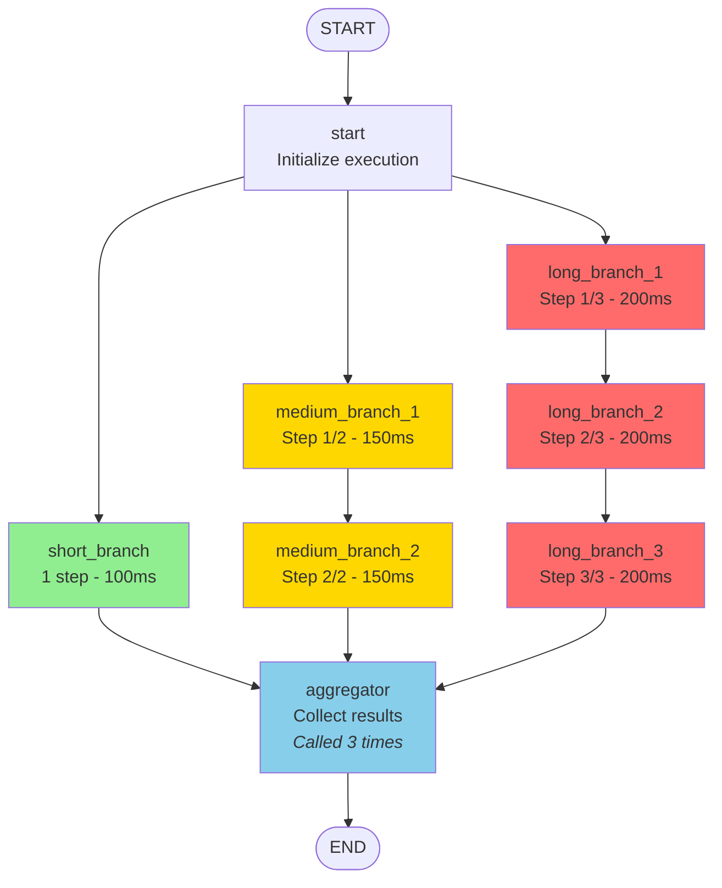
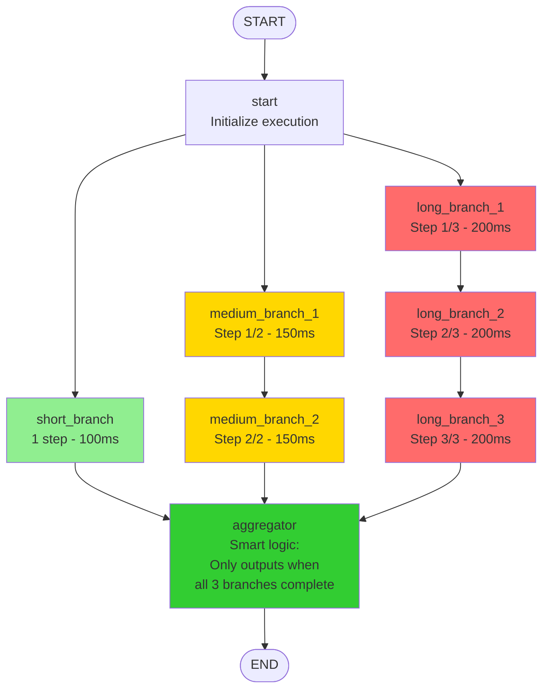
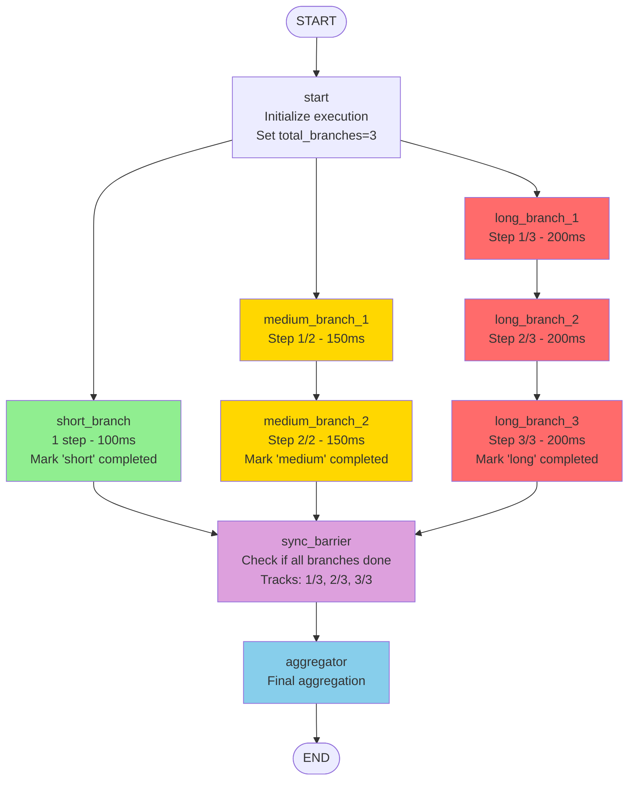

# Complex Parallel Execution Example

This example demonstrates a more sophisticated parallel execution pattern with branches of varying lengths that all converge at a single aggregation point.

## Overview

This example showcases the **fan-out/fan-in** pattern with complex branch structures:

- **Short Branch**: Single-step execution (fastest path)
- **Medium Branch**: Two-step sequential processing
- **Long Branch**: Three-step sequential processing

All branches execute in parallel and converge at a single aggregator node before completing.

## Graph Structure

```
start
  ├─> short_branch (1 step) ────────────┐
  ├─> medium_branch_1 -> medium_branch_2 ├─> aggregator -> END
  └─> long_branch_1 -> long_branch_2 -> long_branch_3 ─┘
```

## Key Features

1. **Parallel Execution**: All three branches start simultaneously from the start node
2. **Variable Length**: Branches can have different numbers of steps (1, 2, or 3 nodes)
3. **Automatic Synchronization**: The aggregator waits for all branches to complete
4. **Result Accumulation**: Uses `AppendReducer` to collect results from all branches

## Use Cases

This pattern is useful for:

- **Multi-source data processing**: Fetch data from multiple sources with different response times
- **Parallel analysis pipelines**: Run different analysis steps that take varying amounts of time
- **Distributed computation**: Execute independent tasks and combine results
- **Workflow orchestration**: Coordinate complex business processes with parallel paths

## Running the Example

```bash
cd complex_parallel_execution
go run main.go
```

## Expected Output

The output will show:
1. All branches executing in parallel
2. Each branch completing at different times
3. The aggregator collecting results from all branches
4. Final state with combined results

## Comparison with Simple Parallel Execution

Unlike the basic `parallel_execution` example where all branches have the same structure, this example demonstrates:

- **Heterogeneous branches**: Different execution paths with different complexities
- **Sequential steps within branches**: Some branches have multiple sequential nodes
- **Real-world scenarios**: More representative of actual application needs

## Implementation Notes

- The graph uses `AppendReducer` for the "results" field to accumulate outputs
- Each branch can maintain its own temporary state during execution
- **Important**: The aggregator node will be called multiple times (once for each branch completion). This is LangGraph's normal behavior for fan-in patterns
- If you need the aggregator to execute only once after all branches complete, you can:
  1. Add logic inside the aggregator to check if all results are present
  2. Use a conditional edge to route to aggregator only when all branches are done
  3. Add a synchronization barrier node (see `main_optimized.go` for an example)
- Execution time is determined by the longest branch (long_branch with 3 steps)

## Flow Diagrams

### Version 1: Basic Implementation (main.go)



### Version 2: Smart Aggregator (main_single_aggregation.go) ✅ Recommended



### Version 3: With Synchronization Barrier (main_optimized.go)



**Legend:**
- 🟢 Green: Short branch (fastest)
- 🟡 Yellow: Medium branch
- 🔴 Red: Long branch (slowest)
- 🔵 Blue: Aggregation nodes
- 🟣 Purple: Synchronization barrier

## Alternative Versions

- **`main.go`**: Basic implementation showing the fan-out/fan-in pattern (aggregator called multiple times)
- **`main_single_aggregation.go`**: Smart aggregator that only outputs once when all branches complete ✅ **Recommended**
- **`main_optimized.go`**: Includes a synchronization barrier node to track branch completion

### Which Version to Use?

- Use `main_single_aggregation.go` for most production scenarios - it's clean and only processes results once
- Use `main.go` to understand the basic parallel execution pattern
- Use `main_optimized.go` to see how to add synchronization tracking
