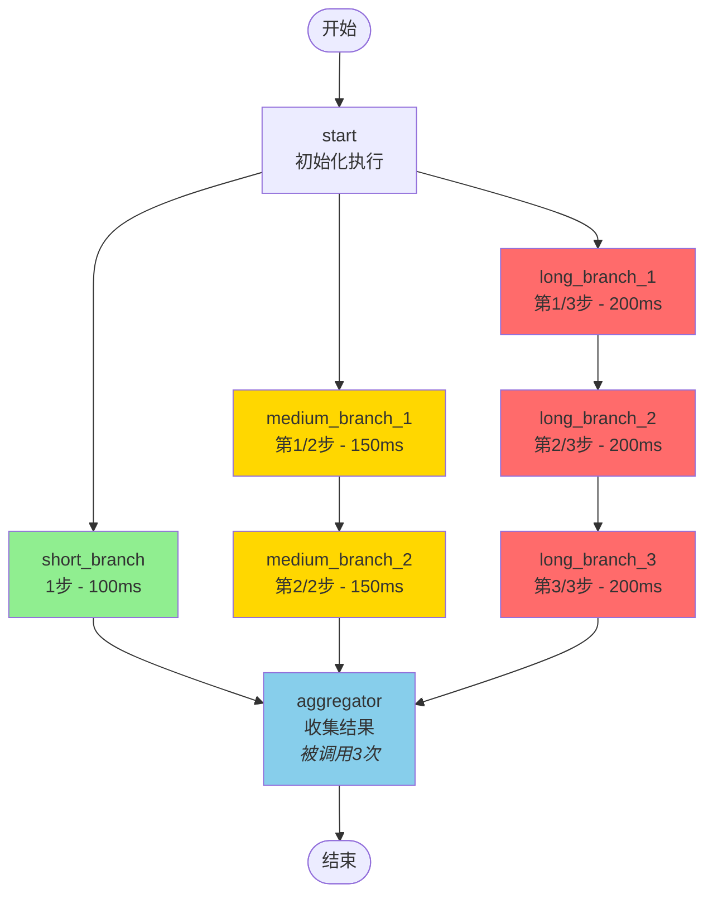
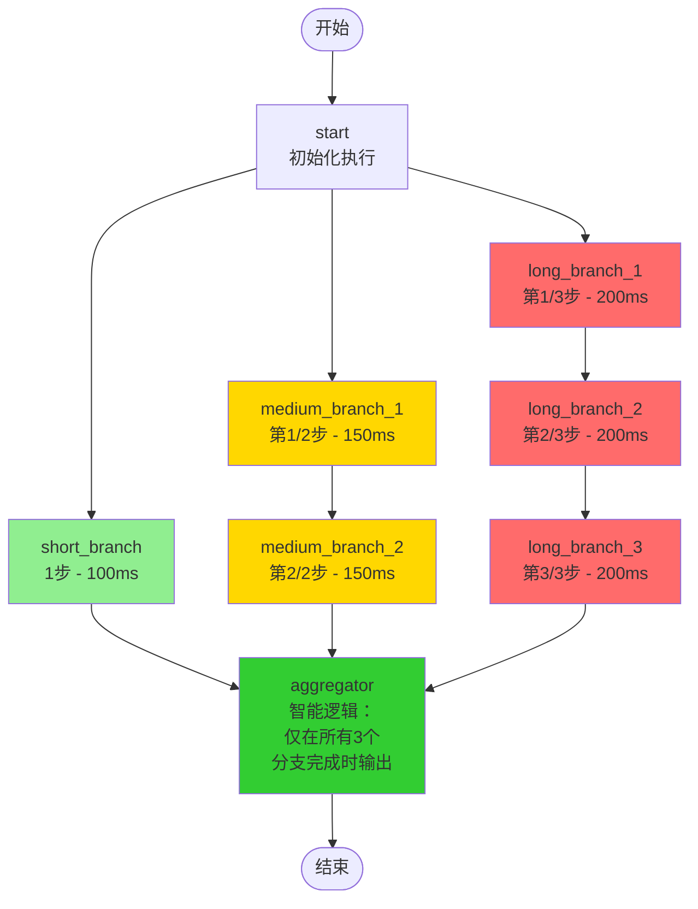
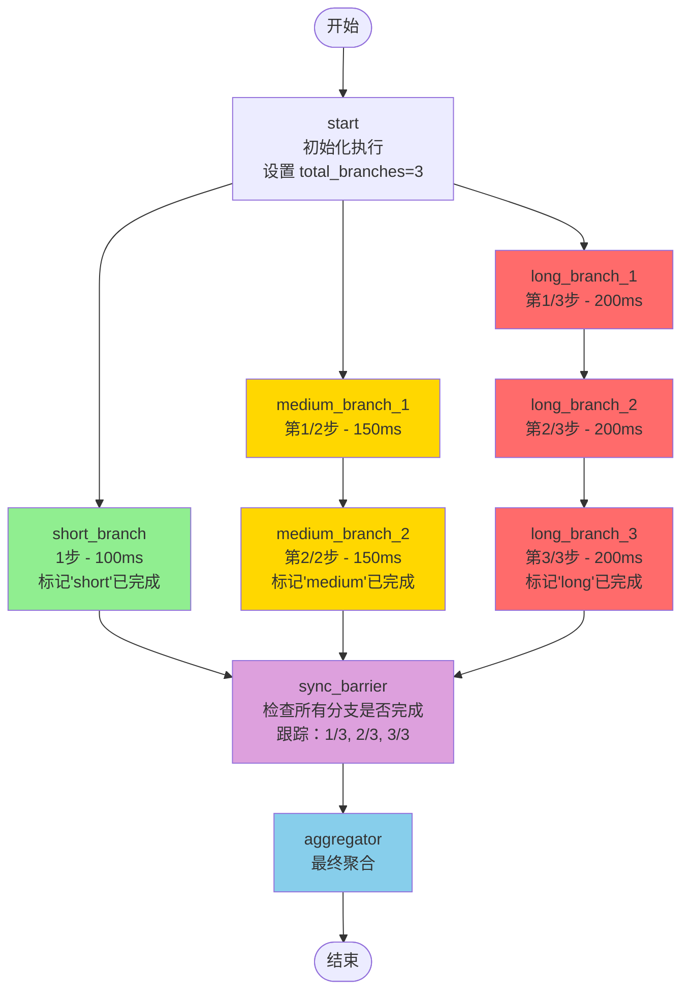

# 复杂并行执行示例

此示例演示了一个更复杂的并行执行模式，包含不同长度的分支，最终都汇聚到一个聚合节点。

## 概述

此示例展示了具有复杂分支结构的**扇出/扇入**模式：

- **短分支**：单步执行（最快路径）
- **中等分支**：两步顺序处理
- **长分支**：三步顺序处理

所有分支并行执行，并在一个聚合器节点汇聚后完成。

## 图结构

```
start
  ├─> short_branch (1步) ────────────┐
  ├─> medium_branch_1 -> medium_branch_2 ├─> aggregator -> END
  └─> long_branch_1 -> long_branch_2 -> long_branch_3 ─┘
```

## 主要特性

1. **并行执行**：所有三个分支从 start 节点同时开始
2. **可变长度**：分支可以有不同的步数（1、2 或 3 个节点）
3. **自动同步**：聚合器等待所有分支完成
4. **结果累积**：使用 `AppendReducer` 收集所有分支的结果

## 使用场景

此模式适用于：

- **多源数据处理**：从多个响应时间不同的数据源获取数据
- **并行分析管道**：运行需要不同时间的不同分析步骤
- **分布式计算**：执行独立任务并组合结果
- **工作流编排**：协调具有并行路径的复杂业务流程

## 运行示例

```bash
cd complex_parallel_execution
go run main.go
```

## 预期输出

输出将显示：
1. 所有分支并行执行
2. 每个分支在不同时间完成
3. 聚合器收集所有分支的结果
4. 包含组合结果的最终状态

## 与简单并行执行的比较

与所有分支具有相同结构的基本 `parallel_execution` 示例不同，此示例演示了：

- **异构分支**：具有不同复杂性的不同执行路径
- **分支内的顺序步骤**：某些分支具有多个顺序节点
- **真实场景**：更能代表实际应用需求

## 实现注意事项

- 图使用 `AppendReducer` 来累积 "results" 字段的输出
- 每个分支可以在执行过程中维护自己的临时状态
- **重要**：聚合器节点会被调用多次（每个分支完成时调用一次）。这是 LangGraph 扇入模式的正常行为
- 如果需要聚合器仅在所有分支完成后执行一次，可以：
  1. 在聚合器内部添加逻辑来检查所有结果是否都已到达
  2. 使用条件边仅在所有分支完成时才路由到聚合器
  3. 添加同步屏障节点（参见 `main_optimized.go` 示例）
- 执行时间由最长的分支决定（long_branch 有 3 个步骤）

## 流程图

### 版本 1：基础实现 (main.go)



### 版本 2：智能聚合器 (main_single_aggregation.go) ✅ 推荐



### 版本 3：带同步屏障 (main_optimized.go)



**图例说明：**
- 🟢 绿色：短分支（最快）
- 🟡 黄色：中等分支
- 🔴 红色：长分支（最慢）
- 🔵 蓝色：聚合节点
- 🟣 紫色：同步屏障

## 替代版本

- **`main.go`**：展示扇出/扇入模式的基本实现（聚合器被多次调用）
- **`main_single_aggregation.go`**：智能聚合器，仅在所有分支完成时输出一次 ✅ **推荐使用**
- **`main_optimized.go`**：包含同步屏障节点来跟踪分支完成状态

### 应该使用哪个版本？

- 对于大多数生产场景，使用 `main_single_aggregation.go` - 它简洁且只处理结果一次
- 使用 `main.go` 来理解基本的并行执行模式
- 使用 `main_optimized.go` 来了解如何添加同步跟踪
